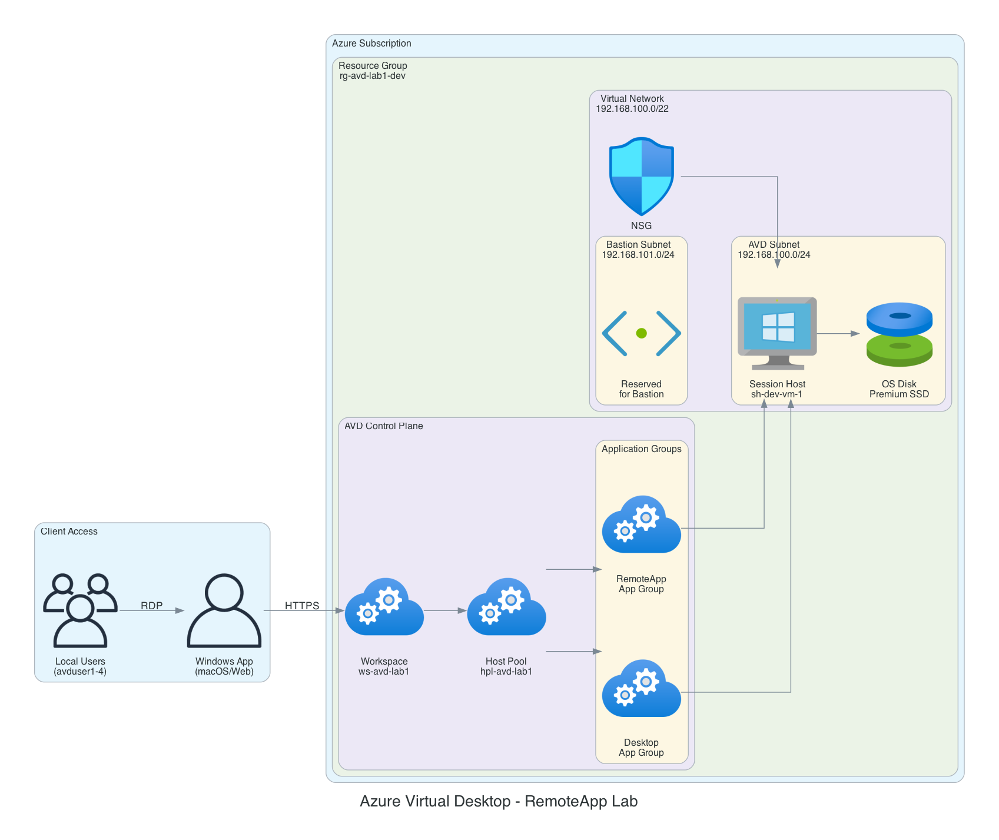

# Azure Virtual Desktop (AVD) Terraform Deployment

Complete Terraform infrastructure-as-code for deploying an Azure Virtual Desktop environment with RemoteApp configuration, supporting multi-user deployment and multi-workspace strategy (dev/prod).

## 🏗️ Architecture



## 📚 Documentation

- **[README.md](README.md)** - Complete deployment guide (this file)
- **[VERIFICATION_GUIDE.md](VERIFICATION_GUIDE.md)** - How to verify installation succeeded ⭐
- **[TROUBLESHOOTING.md](TROUBLESHOOTING.md)** - Solutions for common issues ⭐
- **[QUICK_REFERENCE.md](QUICK_REFERENCE.md)** - Quick command reference
- **[DEPLOYMENT_CHECKLIST.md](DEPLOYMENT_CHECKLIST.md)** - Step-by-step checklist

## 🚀 Quick Verification

After deployment, verify everything is working:

```bash
./verify-installation.sh
```

See [VERIFICATION_GUIDE.md](VERIFICATION_GUIDE.md) for detailed usage.

## Project Structure

```
avd-lab1/
├── bootstrap-storage.sh              # Bootstrap script to create Azure Storage Account for Terraform state
├── verify-installation.sh            # Script to verify application deployment succeeded ⭐
├── VERIFICATION_GUIDE.md             # Detailed guide for verifying installation ⭐
├── TROUBLESHOOTING.md                # Comprehensive troubleshooting guide ⭐
├── QUICK_REFERENCE.md                # Quick command reference
├── DEPLOYMENT_CHECKLIST.md           # Step-by-step deployment checklist
├── backend.tf                        # Terraform backend configuration (Azure Storage)
├── providers.tf                      # Provider configuration (Azure)
├── main.tf                           # Main orchestration file
├── variables.tf                      # Variable definitions
├── terraform.tfvars                  # Shared variable defaults
├── terraform.tfvars.dev              # Dev environment overrides
├── terraform.tfvars.prod             # Prod environment overrides
├── outputs.tf                        # Output definitions
├── .gitignore                        # Git ignore patterns
└── modules/                          # Terraform modules
    ├── networking/                   # VNet, subnets, NSG
    ├── host-pool/                    # AVD host pool configuration
    ├── application-groups/           # Application groups & user assignment
    ├── session-host/                 # VMs with quota checking
    └── application-deployment/       # App installation via Custom Script Extension
```

## Prerequisites

⚠️ **IMPORTANT: Azure CLI Authentication Required**
- Azure CLI installed and authenticated: **`az login`** (REQUIRED BEFORE ANY TERRAFORM/BOOTSTRAP STEPS)
  - `az login` to authenticate to the correct Azure tenant
  - `az account show` to verify you're on the correct subscription
  - `az account list` to list all available subscriptions if needed
  - Use `az account set --subscription <SUBSCRIPTION_ID>` to switch subscriptions if necessary

- Terraform >= 1.0 installed
- PowerShell 5.1+ (on local machine for running bootstrap script)
- Azure subscription with appropriate permissions
- Local users to be assigned: avduser1, avduser2, avduser3, avduser4
- D-family vCPU quota in target region (check via `az vm list-usage`)

## Architecture Overview

### Networking
- **VNet CIDR**: 192.168.100.0/22
- **Subnet 1 (AVD)**: 192.168.100.0/24 - Session hosts
- **Subnet 2 (Bastion)**: 192.168.101.0/24 - Reserved for future Bastion access
- **NSG**: Allows all inbound traffic (public access requirement)

### Host Pool Configuration
- **Type**: RemoteApp (not Desktop)
- **Load Balancing**: Breadth-first
- **Max Sessions**: 2 per host
- **Start VM on Connect**: Enabled
- **RDP Properties**:
  - Clipboard redirection: Enabled ✓
  - Drive redirection: Disabled ✗
  - Multi-display support: Enabled ✓

### Application Groups
1. **Desktop Application Group** - Standard desktop access
2. **RemoteApp Application Group** (Primary) - Published applications

### Session Hosts
- **VM Size**: Standard_D4s_v3 (D-family, 4 vCPUs)
- **OS**: Windows 11 multi-session (MicrosoftWindowsDesktop/windows-11/win11-22h2-avd)
- **Count**: 1 (configurable via `session_host_count` variable)
- **Registration**: Automatic via DSC extension

### Applications Deployed
- File Explorer
- Microsoft Edge
- Task Manager
- Notepad++
- Visual Studio Code
- Visual Studio Code Insiders
- Git
- GitHub Desktop

### User Assignment
- **Users**: avduser1, avduser2, avduser3, avduser4 (local users)
- **Authentication**: Local user authentication
- **Scope**: Both application groups (Desktop & RemoteApp)

## Deployment Steps

### Step 1: Bootstrap Azure Storage Container (One-time)

Run the bootstrap script to create Azure Storage Account for Terraform state:

```bash
cd /path/to/avd-lab1
chmod +x bootstrap-storage.sh

# Optional: Set environment variables
export LOCATION="eastus"
export ENVIRONMENT="dev"

# Run bootstrap script
./bootstrap-storage.sh
```

The script will output:
```
Resource Group:      rg-avd-lab1-tfstate-dev
Storage Account:     stavdlab1XXXX
Container Name:      tfstate

Backend Configuration:
  backend "azurerm" {
    resource_group_name  = "rg-avd-lab1-tfstate-dev"
    storage_account_name = "stavdlab1XXXX"
    container_name       = "tfstate"
    key                  = "env:/${terraform.workspace}/terraform.tfstate"
  }
```

### Step 2: Update Backend Configuration

Copy the backend configuration from bootstrap output and update `backend.tf`:

```hcl
terraform {
  backend "azurerm" {
    resource_group_name  = "rg-avd-lab1-tfstate-dev"
    storage_account_name = "stavdlab1XXXX"
    container_account_name       = "tfstate"
    key                  = "env:/${terraform.workspace}/terraform.tfstate"
  }
}
```

### Step 3: Initialize Terraform

```bash
# Initialize with backend reconfiguration
terraform init -reconfigure

# Verify initialization
terraform workspace list
```

### Step 4: Create Workspaces

```bash
# Create dev workspace
terraform workspace new dev

# Create prod workspace
terraform workspace new prod

# List workspaces
terraform workspace list
```

### Step 5: Configure VM Admin Password

Export the admin password for session hosts (or update `terraform.tfvars`):

```bash
export TF_VAR_vm_admin_password="YourSecurePassword123!"
```

**Note**: Do NOT commit passwords to git. Use environment variables or `.tfvars.local` files (add to `.gitignore`).

### Step 6: Plan Deployment

```bash
# Select dev workspace
terraform workspace select dev

# Plan with dev variables
terraform plan -var-file=terraform.tfvars.dev -out=tfplan

# Review plan output
```

### Step 7: Apply Deployment

```bash
# Apply with dev variables
terraform apply tfplan

# Or apply directly
terraform apply -var-file=terraform.tfvars.dev -auto-approve

# Wait for deployment (typically 15-25 minutes)
```

### Step 8: Verify Deployment

```bash
# Get deployment outputs
terraform output

# Check specific outputs
terraform output host_pool_name
terraform output session_host_vm_names
terraform output assigned_user_email

# View verification instructions
terraform output application_deployment_verification
```

### Step 9: Verify Application Installation

Use the provided verification script to check if applications were installed successfully on the VMs:

```bash
# Run the verification script
./verify-installation.sh
```

The script will:
- Check all session host VMs are running
- Verify run command execution status
- Display installation logs and outputs
- Show success/failure summary for each VM
- Provide troubleshooting guidance if issues are found

**Manual Verification (if needed):**

```bash
# Check run command status for a specific VM
az vm run-command show \
  --resource-group <resource-group-name> \
  --vm-name <vm-name> \
  --name avd-app-deployment \
  --instance-view

# View detailed output
az vm run-command show \
  --resource-group <resource-group-name> \
  --vm-name <vm-name> \
  --name avd-app-deployment \
  --instance-view \
  --query "instanceView.output" -o tsv
```

### Production Deployment

Repeat steps 6-8 for production:

```bash
terraform workspace select prod
terraform plan -var-file=terraform.tfvars.prod
terraform apply -var-file=terraform.tfvars.prod
```

## Configuration & Customization

### Modify Core Settings

Edit `terraform.tfvars` to change shared defaults:

```hcl
# VM Size
vm_size = "Standard_D4s_v3"

# Session host count
session_host_count = 1

# Max sessions per host
max_session_limit = 2

# Local users for AVD access
# avduser1, avduser2, avduser3, avduser4
```

### Environment-Specific Overrides

Edit `terraform.tfvars.dev` or `terraform.tfvars.prod`:

```hcl
# Different VM sizes per environment
session_host_count = 1  # Dev
# vs
session_host_count = 3  # Prod

# Different resource names
resource_group_name = "rg-avd-lab1-dev"  # Dev
# vs
resource_group_name = "rg-avd-lab1-prod" # Prod
```

### Add More Applications

Edit `terraform.tfvars` and add to `rdp_properties` or update the PowerShell deploymentScript in `modules/application-deployment/main.tf`.

### Change Network CIDR

Edit `terraform.tfvars`:

```hcl
vnet_cidr         = "192.168.100.0/22"
subnet_avd_cidr   = "192.168.100.0/24"
subnet_bastion_cidr = "192.168.101.0/24"
```

## Workspace Management

### Switching Between Workspaces

```bash
# List all workspaces
terraform workspace list

# Select workspace
terraform workspace select dev
terraform workspace select prod

# Show current workspace
terraform workspace show

# Delete workspace (must not be current)
terraform workspace delete staging
```

### State File Locations

Each workspace maintains separate state in Azure Storage:

```
Container: tfstate/
├── env:/dev/terraform.tfstate
├── env:/prod/terraform.tfstate
└── terraform.tfstate (default workspace)
```

## Monitoring & Troubleshooting

### Verify Application Installation

**Automated Verification (Recommended):**

```bash
# Run the verification script
./verify-installation.sh
```

This script provides comprehensive checks including:
- VM running status
- Run command execution state
- Installation logs and outputs
- AVD agent registration status
- Detailed error messages if any issues found

**Manual Checks:**

```bash
# Check application deployment run command status
az vm run-command show \
  --resource-group <resource-group-name> \
  --vm-name <vm-name> \
  --name avd-app-deployment \
  --instance-view

# View installation logs on the VM (via RDP/Bastion)
# Check: C:\AVD-Deployment-Logs\app-deployment-*.log
```

### Check Session Host Status

```bash
# List VMs
az vm list -g rg-avd-lab1-dev --output table

# Check VM running status
az vm get-instance-view -g rg-avd-lab1-dev -n sh-dev-vm-1-dev

# Check extension status
az vm extension list -g rg-avd-lab1-dev --vm-name sh-dev-vm-1-dev
```

### View Extension Logs

On session host VM (via Bastion or RDP):

```powershell
# Custom Script Extension logs
Get-Content "C:\WindowsAzure\Logs\Plugins\Microsoft.Compute.CustomScriptExtension\1.10\commandExecutionLog.log"

# Application deployment script
Get-Content "C:\avd-app-deploy.ps1"
```

### Verify User Assignment

```bash
# Verify local users are configured on session hosts
# Connect to the VM and check local user accounts:
# avduser1, avduser2, avduser3, avduser4
```

### Check Host Pool Status

Azure Portal > Azure Virtual Desktop > Host pools > [host-pool-name]
- Session hosts tab: Check registration status
- Users: Verify user assignments
- Diagnostics: Review session activity

### Troubleshooting "No Available Resources" Error

If you see "There are no available resources" when trying to launch remote apps:

1. **Check Session Host Registration:**
   ```bash
   # Verify session hosts are registered with the host pool
   az desktopvirtualization sessionhost list \
     --resource-group <resource-group-name> \
     --host-pool-name <host-pool-name> \
     --query "[].{Name:name, Status:status}" -o table
   ```

2. **Verify Session Host is Available:**
   - Session host must be in "Available" status
   - Check if VM is running: `az vm get-instance-view`
   - Verify AVD agent is installed and running

3. **Check Application Installation:**
   ```bash
   # Run verification script
   ./verify-installation.sh
   ```
   
   If apps failed to install, you may need to:
   - RDP to the VM
   - Manually install applications
   - Or redeploy the run command

4. **Verify User Permissions:**
   ```bash
   # Verify local users are configured on session hosts:
   # avduser1, avduser2, avduser3, avduser4
   # Check Remote Desktop Users group membership
   ```

5. **Check Host Pool Capacity:**
   - Ensure `max_session_limit` is not exceeded
   - Verify no sessions are stuck in "Disconnected" state
   - Check if VMs have enough resources (CPU, RAM)

6. **Review AVD Agent Logs on VM:**
   - RDP to session host
   - Check: `C:\Windows\Temp\ScriptLog.log`
   - Check: Event Viewer > Applications and Services Logs > Microsoft > Windows > TerminalServices-*

## Cleanup & Destruction

### Destroy Dev Environment

```bash
terraform workspace select dev
terraform destroy -var-file=terraform.tfvars.dev
```

### Destroy All Resources

```bash
# Destroy all workspaces
terraform workspace select dev && terraform destroy -var-file=terraform.tfvars.dev
terraform workspace select prod && terraform destroy -var-file=terraform.tfvars.prod

# Destroy storage account and bootstrap RG manually (not managed by Terraform)
az group delete -n rg-avd-lab1-tfstate-dev -y
```

## Security Considerations

1. **State File Security**:
   - State files stored in Azure Storage with encryption
   - Enable Storage Account versioning (done by bootstrap script)
   - Restrict access via RBAC on storage account

2. **Admin Password**:
   - Do NOT commit passwords to git
   - Use environment variables: `TF_VAR_vm_admin_password`
   - Or use `.tfvars.local` (add to `.gitignore`)
   - Consider using Azure Key Vault for production

3. **NSG Rules**:
   - Current config allows all inbound traffic
   - For production, restrict to specific IP ranges
   - Modify `modules/networking/main.tf` for stricter rules

4. **User Assignments**:
   - Uses local user authentication
   - Local users: avduser1, avduser2, avduser3, avduser4
   - Users should be members of Remote Desktop Users group

5. **Marketplace Plan Acceptance**:
   - Windows 11 multi-session requires plan acceptance
   - Automated in Terraform via `plan` block
   - First deployment may require manual acceptance if plan block rejected

## Cost Optimization

- VM Size: Standard_D4s_v3 (~$165/month)
- Per-User Access Pricing: Enabled (requires Azure Subscription licensing)
- Remove/reduce session hosts in dev environment
- Use spot VMs for dev (modify `azurerm_windows_virtual_machine` for cost savings)

## FAQ

**Q: What if VM deployment fails with quota error?**
A: Check quota: `az vm list-usage -l eastus`. Request quota increase via Azure Portal > Quotas.

**Q: How do I scale to more session hosts?**
A: Update `session_host_count` in `terraform.tfvars`:
```hcl
session_host_count = 3  # Creates 3 VMs
```

**Q: How do I add more users to the application groups?**
A: Add additional local users (avduser5, etc.) to the session hosts and ensure they are members of the Remote Desktop Users group.

**Q: Can I use a custom VM image instead of Marketplace?**
A: Yes, modify `modules/session-host/main.tf` `source_image_reference` to use custom image ID.

**Q: Why is application deployment taking so long?**
A: VS Code and Git installers download from internet. Timeout set to 30 minutes. Check logs on VM.

## Support & Documentation

- [Azure Virtual Desktop Documentation](https://docs.microsoft.com/en-us/azure/virtual-desktop/)
- [Terraform Azure Provider](https://registry.terraform.io/providers/hashicorp/azurerm/latest/docs)
- [Azure Virtual Desktop Terraform Examples](https://github.com/Azure/terraform-azurerm-deploy-avd)

---

**Project**: AVD Lab 1  
**Environment**: Development / Production  
**Last Updated**: 2026-01-26  
**Terraform Version**: >= 1.0  
**Azure Provider Version**: >= 3.50

